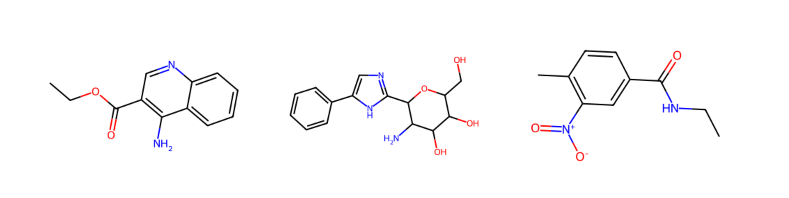
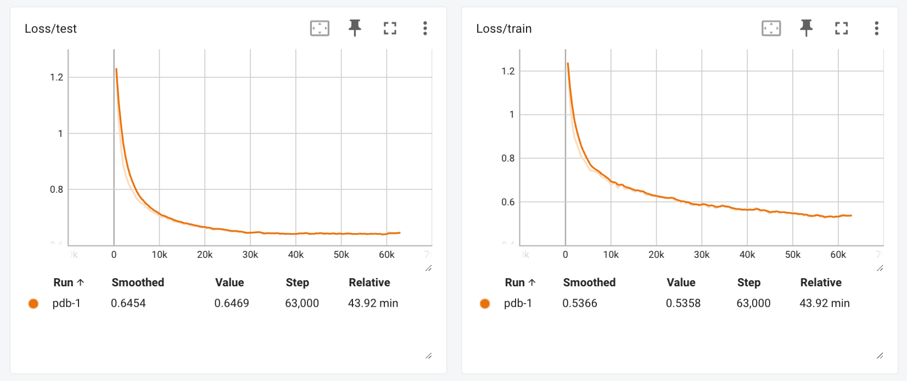

# Molecular language models 

Let's explore how to use a transformer language model to generate new drug-like molecules. Using the code in this repository, we'll train a language model on small-molecule ligands from the PDB represented as SMILES strings and use the model to generate new molecules likely to have biological activity. 


## Obtaining and processing the dataset 

We'll use the excellent PubChem database to create our dataset. Use the web interface to [browse all 36,623 molecules represented in the Protein Data Bank](https://pubchem.ncbi.nlm.nih.gov/#input_type=list&query=-b5cnjLHV3tgUVVI1zAcYHGWovY1JU2PN6pWwyy7RMIsong&collection=compound&alias=PubChem%3A%20PubChem%20Compound%20TOC%3A%20RCSB%20Protein%20Data%20Bank%20(RCSB%20PDB)). Download this list as a CSV. 

We'll process this CSV into a nice list and do some filtering here. Based on examining the dataset, I chose to exclude a few of the smallest ligands and ions, for example "Be+2". Establish a lower and upper bound on molecular weight to enable automated filtering using Polars. 

```python 
import polars as pl 

# filter by molecular weight 
data = df.filter(
    pl.col("mw") < 650, 
    pl.col("mw") > 30, 
).sort(by="mw")["canonicalsmiles"]

# write a list, one molecule per line 
with open("pdb-1.txt", "w") as fn:
    fn.write("\n".join(list(data)))
```

Let's examine a few samples from our dataset. This is a crucial part of being able to model them. 

```python 
>>> data.sample(3).to_list()
['CCOC(=O)C1=C(C2=CC=CC=C2N=C1)N',
 'C1=CC=C(C=C1)C2=CN=C(N2)C3C(C(C(C(O3)CO)O)O)N',
 'CCNC(=O)C1=CC(=C(C=C1)C)[N+](=O)[O-]']
 ```

Using RDKit, we can easily visualize these 

```python 
def draw_molecule(smiles):
    m = Chem.MolFromSmiles(smiles)
    fig = Draw.MolToImage(m)
    display(fig)

draw_molecule('CCOC(=O)C1=C(C2=CC=CC=C2N=C1)N')
```

Looking at samples gives us some idea of the kinds of molecules we're looking at. Of course, you'll want to look at a lot more than just three. Try to look at 10% of the dataset if you can. 



Last, we'll split this set up into 80% training examples, 10% validation examples, and 10% for final evaluation. 


## Creating a molecular language model 

To create the molecular language model, we'll use a transformer architecture. We'll need to implement three main parts: (1) loading and tokenizing the dataset, (2) defining the model architecture, and (3) running the training loop. 


### Define a PyTorch `Dataset` for SMILES strings 

To get started, we'll create a new file called `train.py`. First, we'll want to define a PyTorch `Dataset` class to hold our SMILES strings. We need to decide on a tokenization scheme. In this case, we'll use character-level tokenization, so that some atoms, like `C` and `N` are represented with a single token, bonds are represented with a single token, like `=`, and some atoms are represented with multiple tokens, such as `Cl-` (three tokens in our scheme). 

Defining the dataset class requires only a few methods. We can borrow basically all of this from Andrej Karpathy's [makemore lecture series](https://github.com/karpathy/makemore/), modifying it slightly since these are molecular representations.   

```python 
class SmilesDataset(Dataset):
    """Dataset of SMILES strings"""
    def __init__(self, words, chars, max_word_length):
        self.words = words
        self.chars = chars
        self.max_word_length = max_word_length
        self.stoi = {ch: i + 1 for i, ch in enumerate(chars)}
        self.itos = {i: s for s, i in self.stoi.items()} 

    def __len__(self):
        return len(self.words)

    def contains(self, word):
        return word in self.words

    def get_vocab_size(self):
        return len(self.chars) + 1 
        # all the possible characters and special 0 token

    def get_output_length(self):
        return self.max_word_length + 1
        # <START> token followed by words

    def encode(self, word):
        ix = torch.tensor([self.stoi[w] for w in word], dtype=torch.long)
        return ix

    def decode(self, ix):
        word = ''.join(self.itos[i] for i in ix)
        return word

    def __getitem__(self, idx):
        word = self.words[idx]
        ix = self.encode(word)
        x = torch.zeros(self.max_word_length + 1, dtype=torch.long)
        y = torch.zeros(self.max_word_length + 1, dtype=torch.long)
        x[1:1 + len(ix)] = ix
        y[:len(ix)] = ix
        y[len(ix) + 1:] = -1 
        # index -1 will mask the loss at the inactive locations
        return x, y
```

Note how the dataset class directly outputs the necessary data for training a next-token prediction task. 

With the dataset class defined, let's create a new dataset object using our data. 

```python 
with open(input_file, 'r') as f:
    data = f.read()

words = data.splitlines()
words = [w.strip() for w in words] 
words = [w for w in words if w] 
chars = sorted(list(set(''.join(words)))) 
max_word_length = max(len(w) for w in words)

dataset = SmilesDataset(words)
```

In the script `train.py`, we wrap this in a nice clean function so we can process the different sample splits independently. 


### Define the molecular language model

Now we'll implement the molecular language model. Our model architecture will be the transformer trained on next-token prediction. 

The overall architecture follows GPT-2 closely. We could import this from PyTorch, but it's nice to see that there is nothing scary here, this is a very clean implementation (thanks Andrej)!

```python 
class Transformer(nn.Module):
    """ Transformer Language Model, exactly as seen in GPT-2 """

    def __init__(self, config):
        super().__init__()
        self.block_size = config.block_size

        self.transformer = nn.ModuleDict(dict(
            wte = nn.Embedding(config.vocab_size, config.n_embd),
            wpe = nn.Embedding(config.block_size, config.n_embd),
            h = nn.ModuleList([Block(config) for _ in range(config.n_layer)]),
            ln_f = nn.LayerNorm(config.n_embd),
        ))
        self.lm_head = nn.Linear(config.n_embd, config.vocab_size, bias=False)

        # report number of parameters 
        # (note we don't count the decoder parameters in lm_head)
        n_params = sum(p.numel() for p in self.transformer.parameters())
        print("number of parameters: %.2fM" % (n_params/1e6,))

    def get_block_size(self):
        return self.block_size

    def forward(self, idx, targets=None):
        device = idx.device
        b, t = idx.size()
        assert t <= self.block_size, f"Cannot forward sequence of length {t}, block size is only {self.block_size}"
        pos = torch.arange(0, t, dtype=torch.long, device=device).unsqueeze(0) # shape (1, t)

        # forward the GPT model itself
        tok_emb = self.transformer.wte(idx) 
        # token embeddings of shape (b, t, n_embd)
        pos_emb = self.transformer.wpe(pos) 
        # position embeddings of shape (1, t, n_embd)
        x = tok_emb + pos_emb
        for block in self.transformer.h:
            x = block(x)
        x = self.transformer.ln_f(x)
        logits = self.lm_head(x)

        # if we are given some desired targets also calculate the loss
        loss = None
        if targets is not None:
            loss = F.cross_entropy(logits.view(-1, logits.size(-1)), targets.view(-1), ignore_index=-1)

        return logits, loss
```

In the script `train.py` we define the transformer `Block` as well as the causal self-attention mechanism. In this context, "causal" refers to the use of a triangular mask during the self-attention calculation that presents only the current and past tokens to the model when it is predicting the next token. Without this, the model would have the information about the next token. This is also known as a "decoder-only" architecture. 

In the `forward` method of our `Transformer`, we calculate the cross entropy loss if we are given targets. 

### Training the model to generate new molecules 

Finally, we have our training loop. After some experimentation, some reliable settings for training this model are as follows. We use a transformer with 4 layers, each layer having 4 heads and an embedding dimension of 64. We train for 60,000 steps with a batch size of 32 molecules with a learning rate of `5e-4` with weight decay. Our loss function will be 

```python 
# init optimizer
optimizer = torch.optim.AdamW(model.parameters(), lr=args.learning_rate, weight_decay=args.weight_decay, betas=(0.9, 0.99), eps=1e-8)

# init dataloader
batch_loader = InfiniteDataLoader(train_dataset, batch_size=args.batch_size, pin_memory=True)

# training loop
best_loss = None
step = 0
while True:

    # get the next batch, ship to device, and unpack it to input and target
    batch = batch_loader.next()
    batch = [t.to(args.device) for t in batch]
    X, Y = batch

    # feed into the model
    logits, loss = model(X, Y)

    # calculate the gradient, update the weights
    model.zero_grad(set_to_none=True)
    loss.backward()
    optimizer.step()

    # evaluate the model
    if step > 0 and step % 500 == 0:
        train_loss = evaluate(model, train_dataset, batch_size=128, max_batches=16)
        test_loss = evaluate(model, test_dataset,  batch_size=128, max_batches=16)
```

Checking out the Tensorboard view on this training run, we achieve a loss of 0.64 on the test set, and a bit lower on the training set (0.54) indicating that our model is probably slightly overfit. Something to keep in mind as we design the next set of experiments. 




## What can we learn from a molecular language model? 

The main thing I learned here is that even a relatively small transformer model, provided only SMILES strings, can effectively learn to generate new molecules. I think it would be very interesting to extend this work by adding in the protein sequences that the molecules are associated with in the PDB. 

We know that language models can model proteins well. Here, we have shown that language models can equally be used for molecules. I think it would be very interesting to see if we can combine the two. Some ideas: 

- Train a model on sequences like `{molecule SMILES}{spacer}{protein sequence}`. In this case, we need to pick distinct tokens for the small molecules (we can't use `C` as the token for carbon since it's already cysteine), but we can simply provide the data as strings and use the same architecture. 
    - Will the model's attention mechanism reveal the binding site? 
    - How can we design an eval for this model beyond just looking at the loss? Can we create an eval that measures whether the language model is attending to the molecule tokens when predicting the binding site amino acid tokens
    - How does this compare to `{protein sequence}{spacer}{molecule SMILES}` as the input data? Does this give a model that predicts a ligand given a sequence? 
- Train a multi-model that uses two transformers or other sub-models, one for each of the protein and molecular representation. 
    - Can we use existing pre-trained protein language models to give us a head start? 
    - What kinds of architectures seek to align different kinds of sequence data? 
    - Can we do dumb simple things by enforcing that the cosine similarity of a protein's representation and a molecule's representation is small? Perhaps as part of the loss function? 

